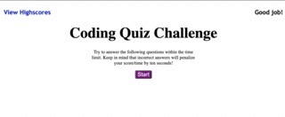

#  Code Quiz

Code quiz is a quiz that demonstrates the use of HTML that is updated dynamically and CSS poweredby JavaScript. A quiz that starts from one question and will update the screen with each individual question so the user can simply move through. At the end the user will enter their Initials and when submitted, the score and initials will be stored in local storage. When the user wants to, they can clear the high scores and try again. Along with UI that is simple and easy to navigate for the user. 

https://gramer35.github.io/Code-Quiz/

https://github.com/Gramer35/Code-Quiz